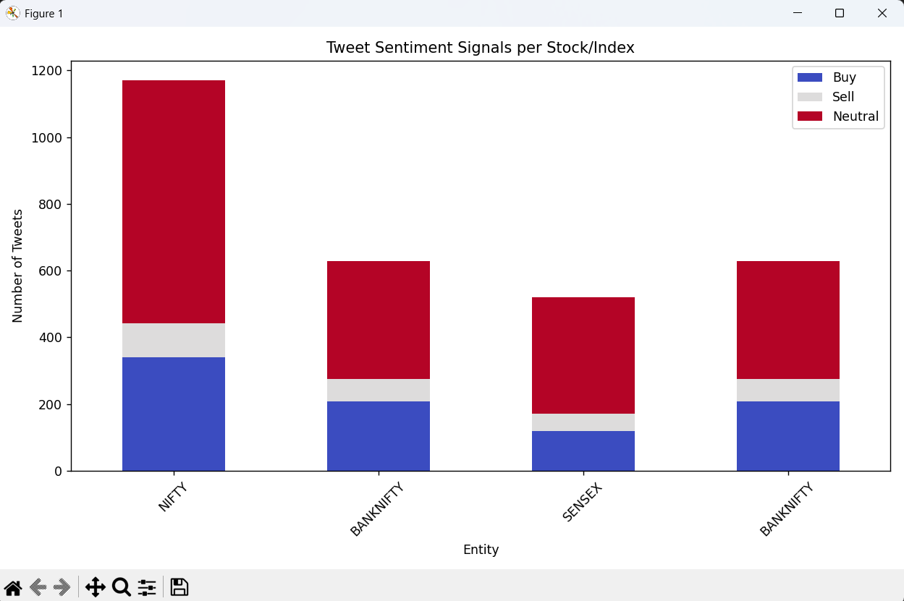

# 📊 Web Scraping and Tweet Sentiment Signal Analyzer

This project is a **complete data pipeline** that scrapes financial tweets from X (Twitter), processes them, and visualizes **trading signals** (Buy/Sell/Neutral) based on tweet content using NLP techniques.

---

## 🔧 Tech Stack

- **Python 3.8+**
- **Libraries**:
  - `pandas`, `re`, `datetime`, `collections`
  - `scikit-learn` (TF-IDF Vectorization)
  - `scipy` (sparse matrices)
  - `matplotlib` & `seaborn` (visualization)
- **Data Storage**: CSV + Parquet + NPZ

---

## 📁 Folder Structure
```
WebScraping/
│
├── data/
│ ├── cleaned.csv ← Cleaned and processed tweets
│ ├── tfidf.npz ← TF-IDF sparse matrix (1000 features)
├── analysis.py ← Data analysis and visualization script
├── scrape.py ← Main script to scrape tweets
├── process.py ← Cleans, deduplicates, and generates signals
├── loggin.py ← Handles login if scraping needs auth
├── auth.json ← Auth credentials (if required)
├── tweets.csv ← Raw scraped tweets
├── screenshot_*.png ← Screenshots from output visualization
├── image.png ← Sample output after execution of analysis.py
└── README.md ← You’re here
```
## ⚙️ Steps to Run
**Note:** 
1. Pre requesite step is to make sure, to execute loggin.py.
2. Loggin to X.
3. Make sure 'auth.json' is not empty and has actualy values and not the dummy I have stored in it. (Currenty I have added dummy data to this file, just to give you an idea on how it must look.)

### 1. Scrape Tweets (X.com)
>>> python scrape.py
This fetches and stores tweets into tweets.csv.


### 2. Clean and Process
>>> python process.py
Cleans text (removes links, mentions, punctuation, etc.)

Removes duplicates
Classifies tweets as:
1 = Buy
-1 = Sell
0 = Neutral

Outputs:
data/cleaned.csv
data/tfidf.npz


### 3. Analyze & Visualize
>>> python analysis.py

Generates:
TF-IDF matrix
Signal counts per stock/index
📊 Bar chart: Buy/Sell/Neutral for NIFTY, BANKNIFTY, SENSEX, etc.


##### Final Output:
